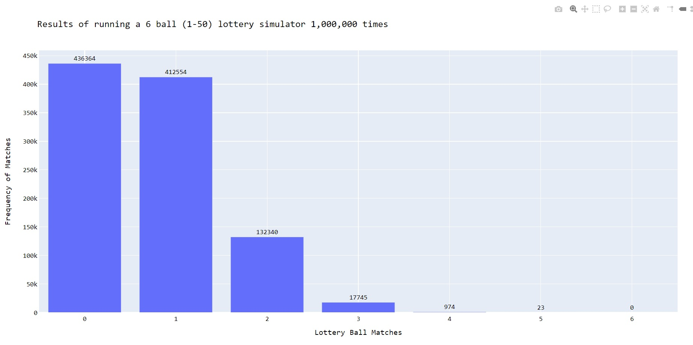

# simple_lottery

A simple lottery simulator that randomly chooses 6 numbers from 1-50 and runs the lottery 1,000,000 times.
The resulting matches from the simulations are visualised in an offline plotted histogram:

